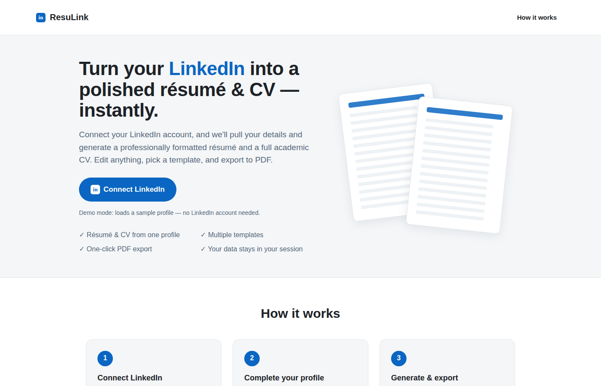

# ResuLink — LinkedIn → Résumé & CV Generator

Connect a LinkedIn account and instantly generate a professionally formatted
**résumé** and a full **CV**. Edit any detail in a live editor, choose from
multiple templates, and export to PDF with one click.



## What it does

1. **Upload your LinkedIn Data Export ZIP** — LinkedIn hands you an official ZIP
   with your full profile (positions, education, skills, languages,
   certifications). Upload it here and everything auto-fills instantly.
   *Alternative:* sign in with LinkedIn OAuth to auto-fill just the basics
   (name, email, photo) — LinkedIn's public API doesn't expose more.
2. **Refine in the editor** — Tweak anything in a clean side-by-side editor
   with live preview.
3. **Generate & export** — Get a curated résumé *and* CV from one profile,
   switch templates (Classic / Modern sidebar / Minimal), and download a
   print-perfect PDF.

## ⚠️ Important: what LinkedIn actually lets an app read

LinkedIn's publicly-approvable API product — **"Sign In with LinkedIn using
OpenID Connect"** — only returns your **basic** profile: name, email, locale and
photo. Rich data (full work history, education, skills, summary) is gated behind
LinkedIn's restricted **Marketing/Talent partner programs** and is **not**
available to a normal third-party app.

So this app does the honest, working thing:

- Uses LinkedIn OAuth to **authenticate** you and pull the basics automatically.
- Lets you **complete the rest** in the editor — optionally seeding it from your
  own [LinkedIn data export](https://www.linkedin.com/mypreferences/d/download-my-data).

Any product that claims to "automatically scrape your full LinkedIn profile"
is either using an unofficial/ToS-violating scraper or has special partner
access. This app stays within LinkedIn's supported API.

## Run it from your phone (no laptop needed)

### Easiest: deploy to Render, get a public URL

Do this in Chrome on your Android phone:

1. Open <https://render.com> and sign up (Google login works).
2. Tap **New +** → **Blueprint** → **Connect a repository** → pick this repo.
3. Render detects `render.yaml` and shows the app **resulink**. Tap **Apply**.
4. Wait ~2 minutes for build → you get a public URL like
   `https://resulink-xxxx.onrender.com`.
5. Open that URL in Chrome → tap **Connect LinkedIn** (demo mode).
6. Optional: menu ⋮ → **Add to Home screen** to install it like an app.

The free tier sleeps after ~15 min idle; first request after sleep takes ~30s
to wake up.

### Alternative: run entirely on your phone with Termux

1. Install [Termux from F-Droid](https://f-droid.org/en/packages/com.termux/)
   (the Play Store version is outdated).
2. In Termux:
   ```bash
   pkg update && pkg install -y nodejs git
   git clone https://github.com/YOUR_USER/lnai.git
   cd lnai && git checkout claude/linkedin-resume-cv-generator-p1hc4s
   npm install && cp .env.example .env
   npm start
   ```
3. Open Chrome and go to <http://localhost:3000>. Keep Termux open to keep
   the server running.

## Quick start (demo mode — no LinkedIn account needed)

```bash
npm install
cp .env.example .env      # DEMO_MODE=true is already set
npm start
```

Open <http://localhost:3000> and click **Connect LinkedIn**. In demo mode this
loads a realistic sample profile so you can try résumé/CV generation end-to-end.

## Using real LinkedIn sign-in

1. Create an app at <https://www.linkedin.com/developers/apps>.
2. In **Products**, add **"Sign In with LinkedIn using OpenID Connect"**.
3. In **Auth**, add this Authorized redirect URL:
   `http://localhost:3000/auth/linkedin/callback`
4. Copy the **Client ID** and **Client Secret** into `.env`:

   ```env
   LINKEDIN_CLIENT_ID=xxxxxxxx
   LINKEDIN_CLIENT_SECRET=xxxxxxxx
   LINKEDIN_REDIRECT_URI=http://localhost:3000/auth/linkedin/callback
   DEMO_MODE=false
   ```

5. `npm start`, then click **Connect LinkedIn** — you'll go through the real
   LinkedIn consent screen.

## Exporting to PDF

Click **Download PDF** in the editor. It opens the browser's print dialog with a
print stylesheet applied (A4, no margins, only the document visible). Choose
**Save as PDF**.

## How it's built

| Layer      | Tech                                                              |
| ---------- | ----------------------------------------------------------------- |
| Server     | Node.js + Express, `express-session` for session-stored profiles  |
| Auth       | LinkedIn OAuth 2.0 / OpenID Connect (`/oauth/v2` + `/v2/userinfo`) |
| Frontend   | Vanilla ES modules, live-rendering editor, print-to-PDF           |
| Templates  | Classic, Modern (sidebar), Minimal — pure CSS                     |

```
server/
  index.js          Express app, routes, session
  linkedin.js       OAuth + userinfo helpers
  demo-profile.js   Sample data for DEMO_MODE
public/
  index.html        Landing page
  editor.html       Profile editor + live preview
  css/style.css     All styles (incl. print + templates)
  js/render.js      Builds résumé/CV HTML from a profile
  js/editor.js      Form binding, repeatable sections, save
```

## Notes on privacy

Profile data lives only in your server-side **session** (in memory) for the
duration of your visit — it is not written to any database. Signing out clears it.

## License

MIT
